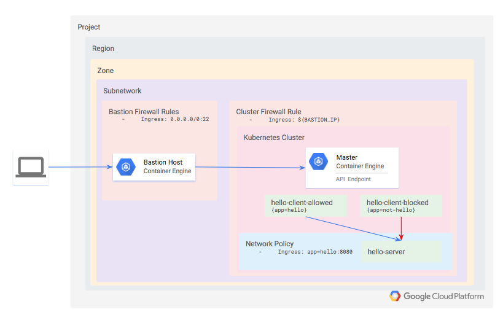
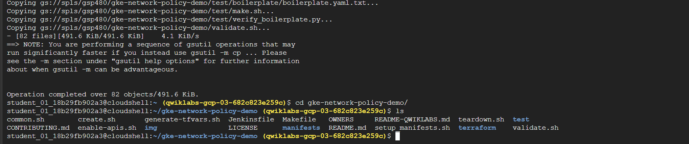
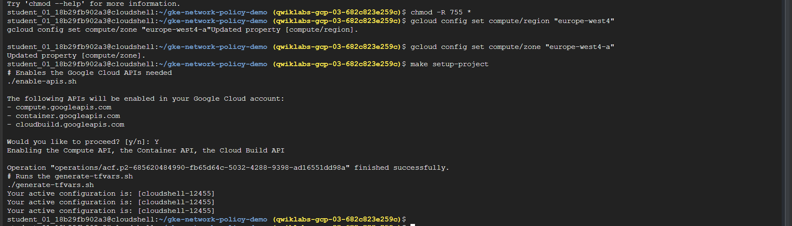
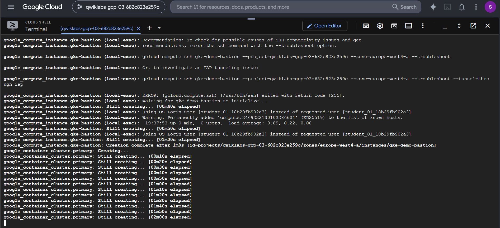
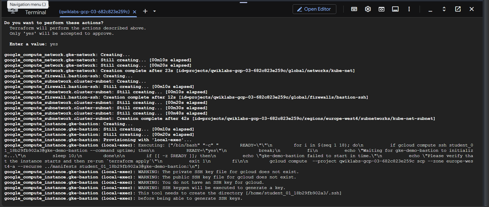
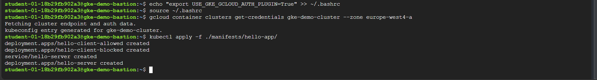
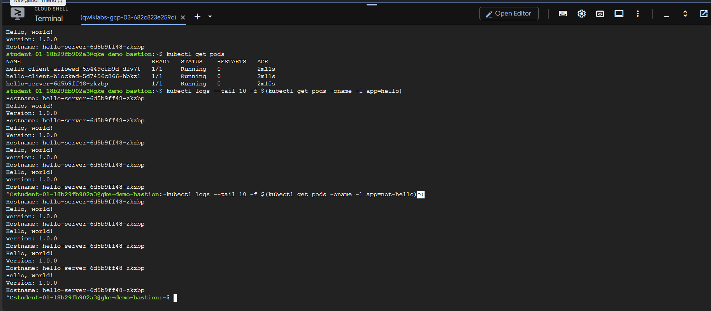
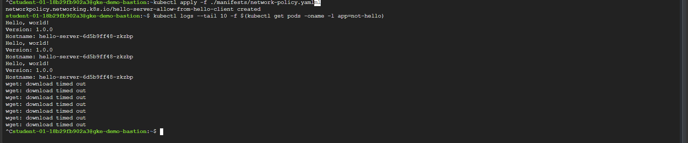
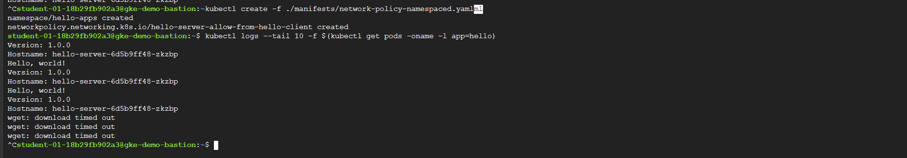
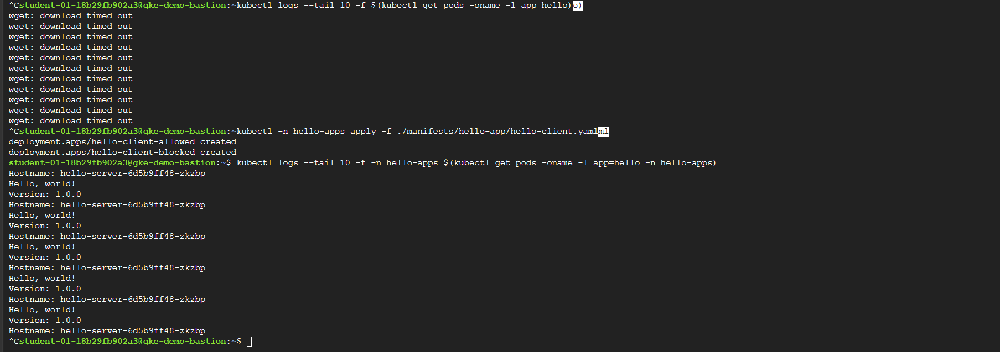

# Restricting Intra-Cluster Traffic with Network Policies on Google Kubernetes Engine

<p align="center">
  
</p>

This lab demonstrates how to secure a private Google Kubernetes Engine (GKE) cluster by applying fine-grained Network Policies. Implementing the Principle of Least Privilege, you will restrict intra-cluster pod-to-pod communications, verify status before and after policy application, and configure namespace-scoped access rules.

---

## Prerequisites & Tools

* **Google Cloud SDK** (gcloud CLI pre-installed)
* **kubectl** (Kubernetes command-line tool, version >= 1.26)
* **Terraform** (for automated infrastructure provisioning)
* **Active GCP Project ID** and configured region (`europe-west4`) & zone (`europe-west4-a`)

---

## Execution Steps

### Phase 1: Infrastructure Provisioning & Environment Setup

Configure regional defaults, fetch the demonstration resources, set up target variables, and run Terraform to provision the GKE private cluster and its associated bastion host.

```bash
# 1. Clone the lab assets from the Cloud Storage bucket
gsutil cp -r gs://spls/gsp480/gke-network-policy-demo .
cd gke-network-policy-demo
chmod -R 755 *

# 2. Set regional compute defaults
gcloud config set compute/region "europe-west4"
gcloud config set compute/zone "europe-west4-a"
```

<p align="center">
  
</p>

```bash
# 3. Enable GCP Service APIs and generate variables
make setup-project
```

<p align="center">
  
</p>

```bash
# 4. Deploy the infrastructure using Terraform
make tf-apply
```

<p align="center">
  
</p>

<p align="center">
  
</p>

---

### Phase 2: Cluster Access and Authentication via Bastion Host

Establish an SSH tunnel to the private cluster's authorized bastion host, install the GKE auth plugin, and update client credentials.

```bash
# 1. Establish SSH connection to the GKE bastion host
gcloud compute ssh gke-demo-bastion

# 2. Install the required GKE Client-go Credential Plugin on the VM
sudo apt-get install google-cloud-sdk-gke-gcloud-auth-plugin

# 3. Configure local environment variables to activate the plugin
echo "export USE_GKE_GCLOUD_AUTH_PLUGIN=True" >> ~/.bashrc
source ~/.bashrc

# 4. Fetch the GKE cluster access credentials
gcloud container clusters get-credentials gke-demo-cluster --zone europe-west4-a
```

<p align="center">
  
</p>

---

### Phase 3: Deploying the Application Workloads

Deploy a standard HTTP server (`hello-server`) along with two test client applications: `hello-client-allowed` (labeled `app=hello`) and `hello-client-blocked` (labeled `app=not-hello`).

```bash
# Apply the application manifests
kubectl apply -f ./manifests/hello-app/

# Verify that all workloads are up and running
kubectl get pods
```

---

### Phase 4: Validating Default (Open) Intra-Cluster Access

Before applying policies, verify that both allowed and blocked clients have unrestricted connectivity to the server.

```bash
# Check logs for the allowed client
kubectl logs --tail 10 -f $(kubectl get pods -oname -l app=hello)

# Check logs for the blocked client
kubectl logs --tail 10 -f $(kubectl get pods -oname -l app=not-hello)
```

<p align="center">
  
</p>

---

### Phase 5: Restricting Pod Traffic with Network Policies

Implement a Kubernetes Network Policy targeting `hello-server` to accept traffic only from pods carrying the label `app=hello`.

```bash
# Apply the network policy
kubectl apply -f ./manifests/network-policy.yaml

# Verify connectivity on the blocked client (which should now timeout)
kubectl logs --tail 10 -f $(kubectl get pods -oname -l app=not-hello)
```

<p align="center">
  
</p>

---

### Phase 6: Restricting Access using Namespaced Network Policies

Transition to namespace-isolated restrictions. Configure the Network Policy to permit requests only from a specified namespace, and redeploy client workloads into that target namespace.

```bash
# 1. Clean up the existing cluster-wide Network Policy
kubectl delete -f ./manifests/network-policy.yaml

# 2. Apply the namespaced Network Policy
kubectl create -f ./manifests/network-policy-namespaced.yaml
```

<p align="center">
  
</p>

```bash
# 3. Verify that the allowed client in the default namespace is now blocked
kubectl logs --tail 10 -f $(kubectl get pods -oname -l app=hello)

# 4. Deploy copies of client applications inside the allowed namespace 'hello-apps'
kubectl -n hello-apps apply -f ./manifests/hello-app/hello-client.yaml

# 5. Check logs for the allowed client inside the new namespace
kubectl logs --tail 10 -f -n hello-apps $(kubectl get pods -oname -l app=hello -n hello-apps)
```

<p align="center">
  
</p>

---

## Verification & Teardown

### cost-mitigation clean-up commands

Ensure all deployed Google Cloud resources are destroyed to prevent ongoing billing charges.

```bash
# Exit the bastion host VM shell
exit

# Execute the Terraform teardown target
make teardown
```
